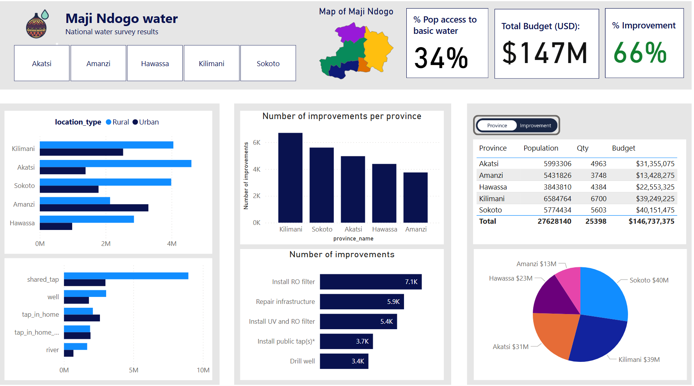
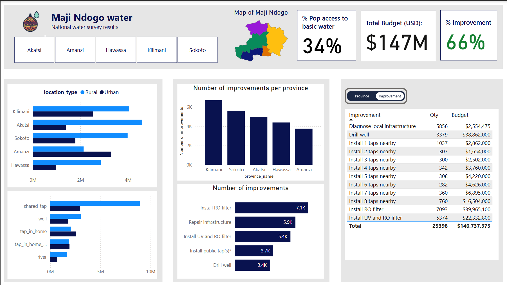
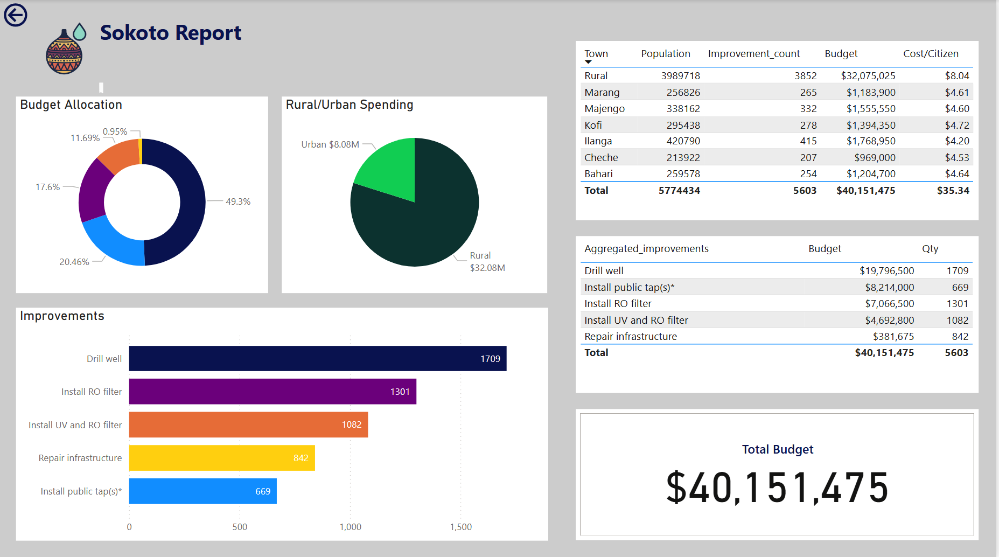
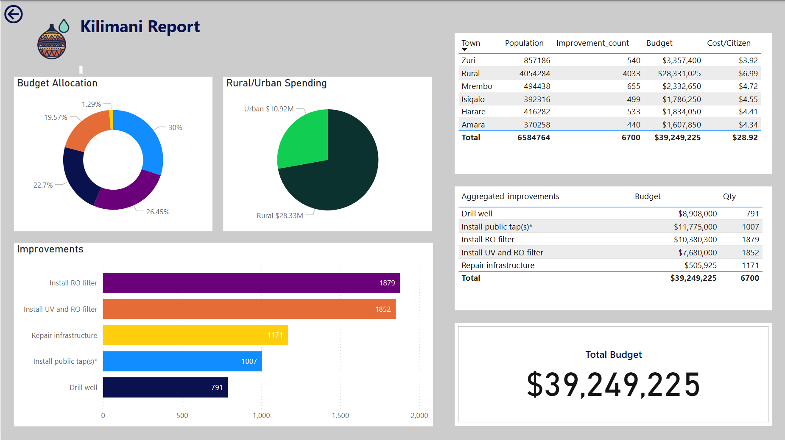
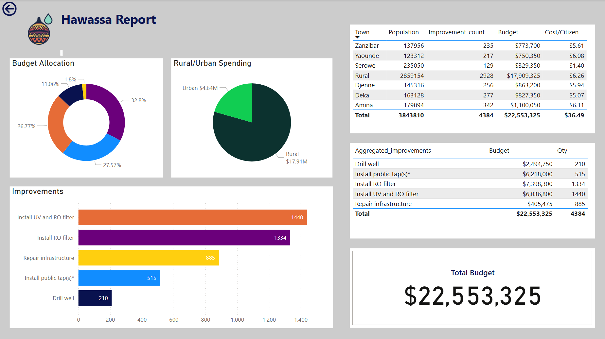
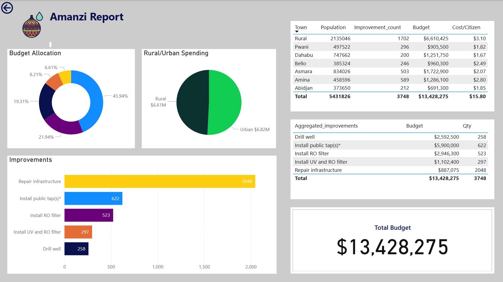
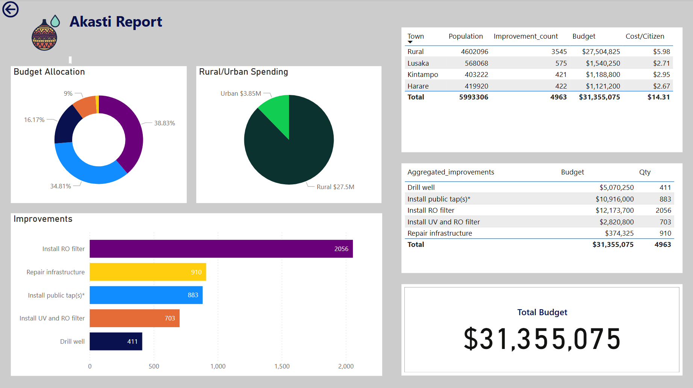

# 🌍💧 Maji Ndogo Water Crisis — Data-Driven Insights & Sustainable Solutions  
*A SQL-powered analysis revealing the reality behind water access, infrastructure failures, and the path toward clean water for all.*

---

## 🚀 Project Summary

This project investigates the water access crisis in **Maji Ndogo**, using SQL and Power BI to uncover the real issues affecting millions of residents across the country.  
Through structured analysis, dashboards, and clear visual storytelling, the project highlights contamination risks, infrastructure breakdowns, corruption patterns, and the resources needed to fix these challenges.

The goal is simple:  
**Turn raw data into clear insights that help leaders make better decisions for sustainable, equitable water access.**

---

## 🎯 Objectives

- Understand where clean water is available and where it has failed.
- Identify towns facing contamination, long queues, or broken infrastructure.
- Estimate the budget required to repair and expand water access.
- Provide government leaders with a clear roadmap for action.
- Share findings through a publicly accessible Power BI dashboard.

---

## 🛠️ Tools & Technologies

| Tool | Purpose |
|------|---------|
| **SQL (MySQL Workbench)** | Data cleaning, querying, transformation, and validation |
| **Power BI** | Visual storytelling, dashboards, geospatial insights, metrics, and KPI tracking |
| **Excel (initial data)** | Raw dataset provided from Explore AI academy for the ALX data analytics program |

---

## 🗂️ Project Structure

├── data/
│   └── raw/                       
│
├── sql/
│   ├── analysis/                  
│   └── transformations/          
│
├── powerbi/
│   ├── datasets/                  
│   └── documentation/             
│
├── measures/
│   └── DAX_measures.md            # All DAX calculations used in the dashboard
│
├── reports/
│   └── maji_ndogo_dashboard.pbix  # Final Power BI project file
│
├── screenshots/                   # Images of dashboard pages (optional for README)
│
└── README.md                      # Project documentation (this file)

---

## 📊 What the Analysis Revealed

The story behind the data paints a clear picture of life in Maji Ndogo:

- **Many rural communities rely on broken or unreliable taps**, forcing long queues and unsafe alternatives.
- **Water contamination remains a major challenge**, especially in areas dependent on rivers or shallow wells.
- **Infrastructure failures are widespread** — improvement of taps in home will reduce the population dependent on shared water or wells.
- **Resources are unevenly distributed**, and certain provinces like *Sokoto* and *Kilimani* require significantly higher budgets.
- **Queue times exceed 30 minutes in many locations**, signaling insufficient water points for the growing population.
- **Drilling of wells** though expensive, serves more people and will also reduce the queue time largely thereby reducing the cost of installing share taps.
  
What stood out most is how **data can highlight both the scale of the crisis and the opportunities for meaningful, targeted improvement**.

---

## 📈 Power BI Dashboard

The dashboard gives leaders a complete view of:

- Water source distribution (rural vs. urban)
- Types of improvements needed
- Budget breakdowns by town and province
- Contaminated or high-risk areas
- Total population affected per region

It’s designed so anyone — from a field engineer to a provincial leader — can understand the situation in seconds.

---

## Screenshots of Maji Ndogo dashboard

---

## How to Navigate the Documentation

To keep things structured:

- **KPI definitions** → `KPI_definitions.md`  
- **Explanation of visuals** → `visuals_explained.md`  
- **Dashboard screenshots** → `/documentation/screenshots/`

---

## 🔧 How to Reproduce the Project

1. Install MySQL.
2. Import the `Md_water_services_data.xlsx` file into MySQL Workbench.
3. Open Power BI Desktop.
4. Connect Power BI to the MySQL database.
5. Load tables → build visuals → publish.

---

## About the Project

This project was completed by **Mercy Obasi** as part of the **ALX Data Analytics Program**.  
It blends technical analysis with real-world storytelling — because data is more powerful when it connects to the people behind the numbers.

---

## 🤝 Let’s Connect

If you’d like to discuss the project, collaborate, or share feedback:

- **LinkedIn:** *[LinkedIn_profile](linkedin.com/in/mercy-chisom-obasi)*
- **Email:** *[Mercy's email](mercyjohnsonone@gmail.com)*

---

## 💡 Final Note

This project isn’t just a dashboard.  
It’s a window into the daily struggles of millions — and a reminder that data, when used right, can guide real, life-changing decisions.

Clean water is a basic right.  
This work is one step toward making that a reality for everyone in Maji Ndogo.

