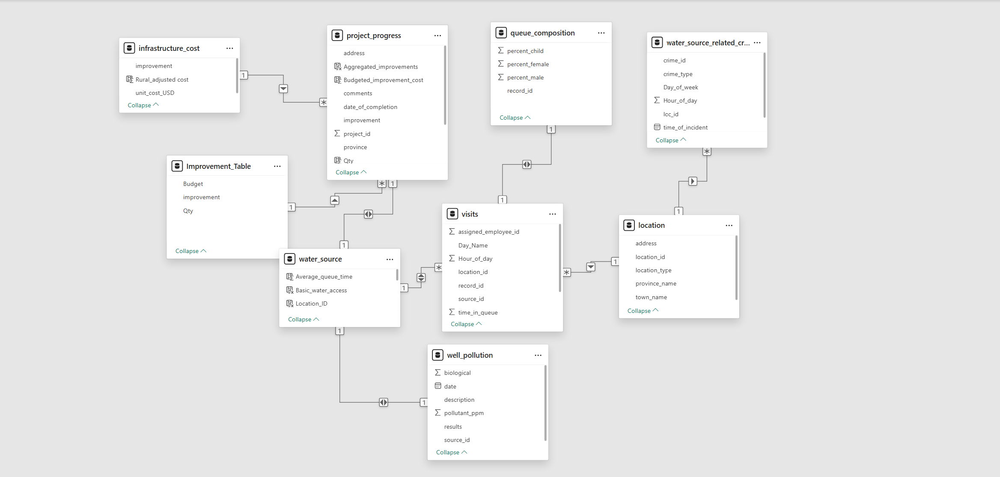

# Maji Ndogo Water Services Dashboard Overview

| **Field**         | **Detail**                                                               |
|-------------------|---------------------------------------------------------------------------|
| Project Sponsor   | The President's Office, Maji Ndogo (Fictional)                           |
| Developed By      | Mercy Obasi as part of the ALX Data Analytics Program                    |
| Last Updated      | 11/31/2025                                                                |
| Version           | 1.0 (Final Submission)                                                    |
| Target Audience   | President of Maji Ndogo, Provincial Leaders, Field Engineers             |

## Project Overview

This dashboard is a strategic monitoring tool commissioned to address the critical water access crisis within the fictional nation of Maji Ndogo. The data, though simulated for this ALX project, reflects realistic challenges faced by developing nations.

**Intended Audience and Use Cases:**

*   **The President/Provincial Leaders:** The high-level overview provides immediate KPIs on national water access percentage, budget variance, and overall project status for strategic decision-making.
*   **Field Engineers:** The detailed report pages (linked via navigation) offer granular data on specific well pollution types, infrastructure requirements, and location-specific visit details to guide field operations and resource allocation.
  
The primary objectives are:
1.  **Monitor water access KPIs** at national, provincial, and rural/urban levels.
2.  **Identify locations** requiring immediate infrastructure upgrades.
3.  **Estimate required budgets** and track project progress effectively.

Users are encouraged to use the main dashboard page for a high-level summary and utilize the navigation buttons to drill down into specific provinces or analysis views.

**For detailed metric definitions, please refer to the [KPI Definitions document](./KPI_definitions.md).**
**For help using the visuals, please see the [Visuals Explained document](./visuals_explained.md).**

## Data Source and Project Scope

All data used in this dashboard is fictional, provided by the **ALX Data Analytics program** as part of a capstone project simulation. The country of Maji Ndogo is a non-existent entity.

The data is designed to mimic a real-world scenario of a water crisis to demonstrate data cleaning, modeling, analysis, and visualization skills. The findings and recommendations are based purely on this simulated dataset.

A comprehensive explanation of data lineage, refresh schedules, and data quality issues can be found in the [Data Sources and Refresh document](./data_sources_and_refresh.md).

## Dataset used

The data for this dashboard is sourced from the `Md_water_services_data.xlsx`

| Dataset / File Name         | Description                                                                                                                                         |
| ------------------------------- | ------------------------------------------------------------------------------------------------------------------------------------------------------- |
| [Md_water_services_data.xlsx](../datasets/Md_water_services_data.xlsx) | Main database containing all tables used in the report.                                                                                             |
| Well_pollution              | Provides additional details on some water sources, specifically wells. It identifies which wells are polluted and the type of pollution affecting them. |
| Water_source                | Contains information on each water point visited, including the type of water source and the number of people depending on it in different locations.  |
| Visits                      | The fact table, capturing thousands of field inspections across Maji Ndogo. Each row represents a visit by a field officer to a water source.       |
| Queue_composition           | Records what was observed at each location’s queue: the average waiting time and the gender distribution of people queuing.                             |
| Project_progress            | Details the water sources that require improvements, the type of upgrade needed, and the associated unit costs.                                         |
| Location                    | Contains the geographic information of each visit, linking water sources to their respective areas across Maji Ndogo.                                   |
| Infrastructure_cost         | Lists the types of infrastructure improvements and their unit costs. Used to calculate project budgets.                                                 |

## Data Model

The data model for the Maji Ndogo project is a multi-star schema. This is because the database doesn’t revolve around a single central fact table. Instead, it contains multiple tables that record different types of events, each supported by its own set of dimensions.

The visits table is the primary fact table. It contains thousands of inspection records collected across different water sources. Each row represents one site visit, with columns that include time spent in queue, assigned employee, the location of the visit, and the water source inspected. Dimension tables linked to the visits table include location, water_source, well_pollution, and queue_composition, with mostly 1-to-many relationships.

The project_progress table gives details on the improvements planned or completed at each water source, including costs, improvement type, and completion dates. It serves as another fact table, linking to the infrastructure_cost and Improvement_Table through 1-to-many relationships. These tables describe events or metrics not tied to visits. Their granularity is different from the visits table.

Overall, because the dataset contains multiple independent processes (inspections, pollution testing, crime records, improvement projects), the model naturally forms a multi-star schema. Each fact table shares some common dimensions, most importantly water_source and location, which act as the central hubs that connect the different stars.

**For specifics on DAX measures and relationship cardinality, please consult the [DAX measures](../measures/DAX_measures.md) and [Data Sources and Refresh document](./data_sources_and_refresh.md).**

## Insights and Interpretation
This section summarizes the high-level findings and conclusions drawn from the dashboard:

* Rural areas require significantly higher investment. Improvement costs are about 50% higher in rural communities, meaning they consume a larger share of the upgrade budget.

* Shared taps remain a major pain point. Many of them exceed the 30-minute queue time threshold, indicating insufficient access. This suggests that installing additional taps will account for a substantial portion of future budgets.

* Wells are costly but efficient. Although drilling wells is expensive, they can serve large numbers of people. In some locations, drilling a well may be more cost-effective than installing many shared taps.

* Infrastructure failure is widespread. About 45% of people are affected by non-functional systems (broken pipes, damaged pumps, or faulty reservoirs). Places such as Amina, rural Amanzi, and parts of Akatsi and Hawassa have the highest breakdown rates.
Repairing these systems can quickly restore water to many people and reduce queue pressure elsewhere effectively solving two problems at once.

* Budget demand varies across provinces. Sokoto accounts for approximately `28%` of the total required budget, followed by Kilimani at `26%`, indicating where the heaviest investment will be needed.
